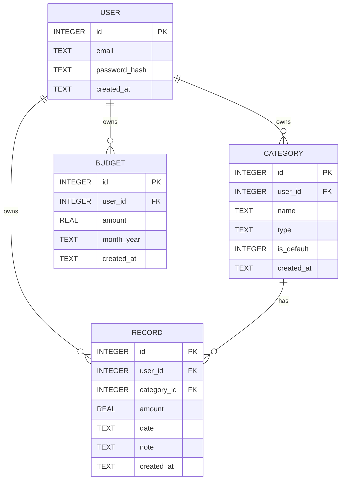

# 資料庫設計 (DB Design)

## 1. ER 圖

## 2. 資料表詳細說明

### `users` 表
| 欄位 | 型別 | 必填 | 說明 |
| :--- | :--- | :--- | :--- |
| `id` | INTEGER | V | 主鍵 (Auto Increment) |
| `email` | TEXT | V | 用戶登入信箱 (Unique) |
| `password_hash` | TEXT | V | 經過加密的密碼 |
| `created_at` | TEXT | V | 建立時間 (ISO 8601) |

### `categories` 表
| 欄位 | 型別 | 必填 | 說明 |
| :--- | :--- | :--- | :--- |
| `id` | INTEGER | V | 主鍵 (Auto Increment) |
| `user_id` | INTEGER |  | 若為 Null 則表示系統預設分類，否則為 `users.id` 外鍵 |
| `name` | TEXT | V | 分類名稱（如：伙食、交通） |
| `type` | TEXT | V | 收支類型：`expense` 或 `income` |
| `is_default` | INTEGER | V | 1 為系統預設不可刪除，0 為自訂 |
| `created_at` | TEXT | V | 建立時間 |

### `records` 表
| 欄位 | 型別 | 必填 | 說明 |
| :--- | :--- | :--- | :--- |
| `id` | INTEGER | V | 主鍵 (Auto Increment) |
| `user_id` | INTEGER | V | `users.id` 外鍵 |
| `category_id` | INTEGER | V | `categories.id` 外鍵 |
| `amount` | REAL | V | 收支金額 |
| `date` | TEXT | V | 記帳發生日期 (YYYY-MM-DD) |
| `note` | TEXT |  | 備註 |
| `created_at` | TEXT | V | 建立時間 |

### `budgets` 表
| 欄位 | 型別 | 必填 | 說明 |
| :--- | :--- | :--- | :--- |
| `id` | INTEGER | V | 主鍵 (Auto Increment) |
| `user_id` | INTEGER | V | `users.id` 外鍵 |
| `amount` | REAL | V | 預算總額 |
| `month_year` | TEXT | V | 対象月份 (格式 YYYY-MM) |
| `created_at` | TEXT | V | 建立時間 |
