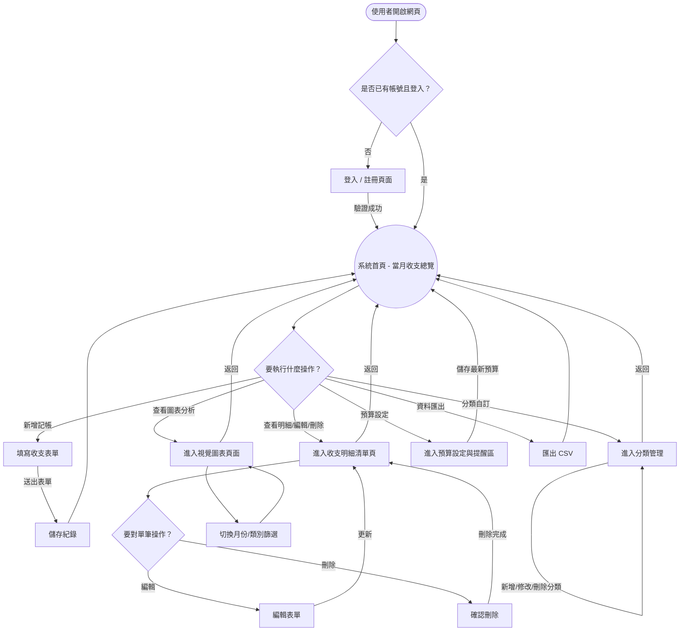
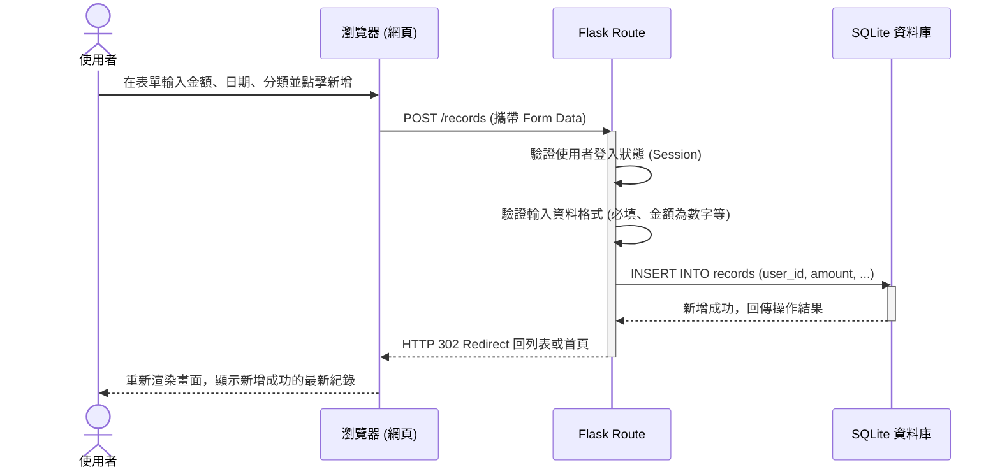

# 個人記帳簿系統流程圖 (Flowchart)

> **說明**：由於目前目錄中尚未建立 `ARCHITECTURE.md`，以下流程圖與對照表將基於 `PRD.md` 定義的需求，以及 Flask + SQLite 的基本架構假設進行繪製。

## 1. 使用者流程圖（User Flow）

此流程圖描述使用者從開啟系統到各個核心操作動作的路徑。

## 2. 系統序列圖（Sequence Diagram）

此序列圖描述核心操作「使用者點擊新增一筆收支紀錄」從前端到資料庫的資料流與技術處理步驟。

## 3. 功能清單對照表

以下為基於 PRD 整理的主要功能與預期開發的 Route 端點、HTTP Method 對照：

| 功能項目 | API / URL 路徑 | HTTP 方法 | 說明 |
| :--- | :--- | :--- | :--- |
| **會員註冊** | `/register` | GET, POST | GET: 顯示註冊頁面   POST: 處理帳號建立 |
| **會員登入** | `/login` | GET, POST | GET: 顯示登入頁面   POST: 驗證密碼寫入 Session |
| **會員登出** | `/logout` | GET | 清除 Session 並導向登入頁 |
| **系統首頁** | `/` | GET | 顯示當月總結區塊與快速新增表單 |
| **新增紀錄** | `/records` | POST | 接收新增收支的表單資料 |
| **收支明細清單** | `/records` | GET | 列出使用者所有的收支紀錄（支援 Query 參數做月份過濾）|
| **編輯單筆紀錄** | `/records/<id>/edit` | GET, POST | GET: 取得單筆資料並顯示編輯表單   POST: 儲存變更 |
| **刪除單筆紀錄** | `/records/<id>/delete`| POST | 刪除單一紀錄（為防 CSRF 通常避免使用 GET 刪除） |
| **圖表分析** | `/dashboard` | GET | 呈現統計圓餅圖/長條圖 |
| **分類管理** | `/categories` | GET, POST | 列出與新增自訂分類 |
| **預算設定** | `/budget` | GET, POST | 顯示與更新每月預算設定 |
| **匯出資料** | `/export/csv` | GET | 產生該用戶紀錄的 CSV 供下載 |
